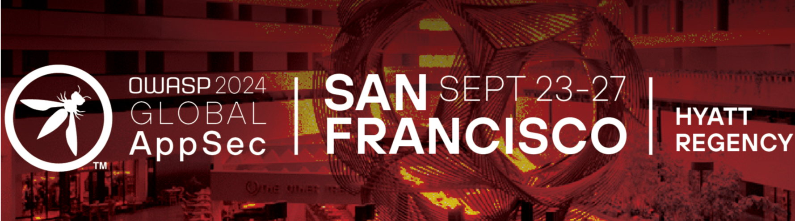
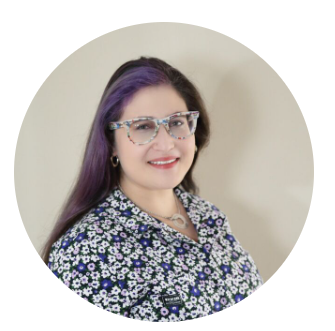
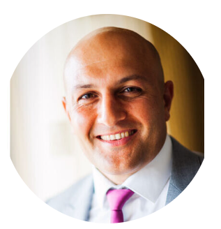

# Jump to an event

* [Meet the ASVS team at Global AppSec San Francisco 2024](#meet-the-asvs-team-at-global-appsec-san-francisco-2024)
* [OWASP ASVS Community Meetup - Lisbon 2024](#owasp-asvs-community-meetup---lisbon-2024)

 
 
 
 

---

---

# Meet the ASVS team at Global AppSec San Francisco 2024

You can meet some of the ASVS team and hear about using the ASVS at OWASP Global AppSec San Francisco 2024 happening between 23-27 September.

 

### Get updated on the ASVS

Two of our working group, [Shanni Prutchi](https://www.linkedin.com/in/shanni-prutchi/) and [Ryan Armstrong](https://www.linkedin.com/in/ryarmst/) will be delivering a short talk about the ASVS project and the latest developments and plans.

You can catch them at 14:15 on Friday afternoon in the Bayview A room. Add it to your conference schedule [here](https://sched.co/1lIO2).

(Ryan and Shanni are also doing their own excellent talks at the conference so dont forget to check those out [here](https://sched.co/1g3Wd) and [here](https://sched.co/1g3aZ)!)

 

### Hear about using the ASVS

Shortly afterwards, [Aram Hovsepyan](https://www.linkedin.com/in/aramhovsep/) will be giving a talk about "Maturing Your Application Security Program with ASVS-Driven Development". In the talk Aram explains how leveraging ASVS for deriving security test cases can create a common theme across all stages of the software development lifecycle.

If you are interested in how to apply ASVS in your development teams, add it to your conference schedule [here](https://sched.co/1g3ac).

 

### Engage with the Community

Our new Community Manager [Matthew Aderhold](https://www.linkedin.com/in/matthewaderhold/) will also be at the conference so make sure you catch him to grab some stickers, talk to him about how you are using ASVS and get more information on how you can engage with the ASVS community! He will be there from day 1 of the training so you have plenty of time to catch him!

If you have contributed to the ASVS, make sure you let him know as he will have some special shiny stickers for contributors!

 

### We hope to see you there at Global AppSec San Francisco 2024

 
 
 
 

---

---

# OWASP ASVS Community Meetup - Lisbon 2024

We held a community meetup for the ASVS project as part of Global AppSec Lisbon on 27th June 2024!

Jim Manico gave the opening keynote to reintroduce the ASVS and the background behind the project and we had some [other great talks](#full-agenda) as well!

There was also an update on the current status of the standard and time allocated to work on the upcoming version 5.0.

You can see full details in the blog post we published about it: <https://owasp.org/blog/2024/07/03/asvs-community-meetup.html>

Additionally, we would love to get more community members involved in the ASVS and other than working on the standard we also have information about other volunteering opportunities to help develop and promote the project! See the "[Get Involved](https://appsecg.host/asvsgetinvolved)" tab above!.

## Full Agenda

You can see the current agenda we had here.

<a id="sched-embed" href="https://owaspglobalappseclisbon2024.sched.com/type/ASVS+Community+Meetup/" data-sched-sidebar="no">View the ASVS Community Meetup schedule.</a>

## Meetup Supporter

Thanks to our friends at [Jit](https://jit.io) for supporting this exciting initiative!

 
 
 
 

---

---

