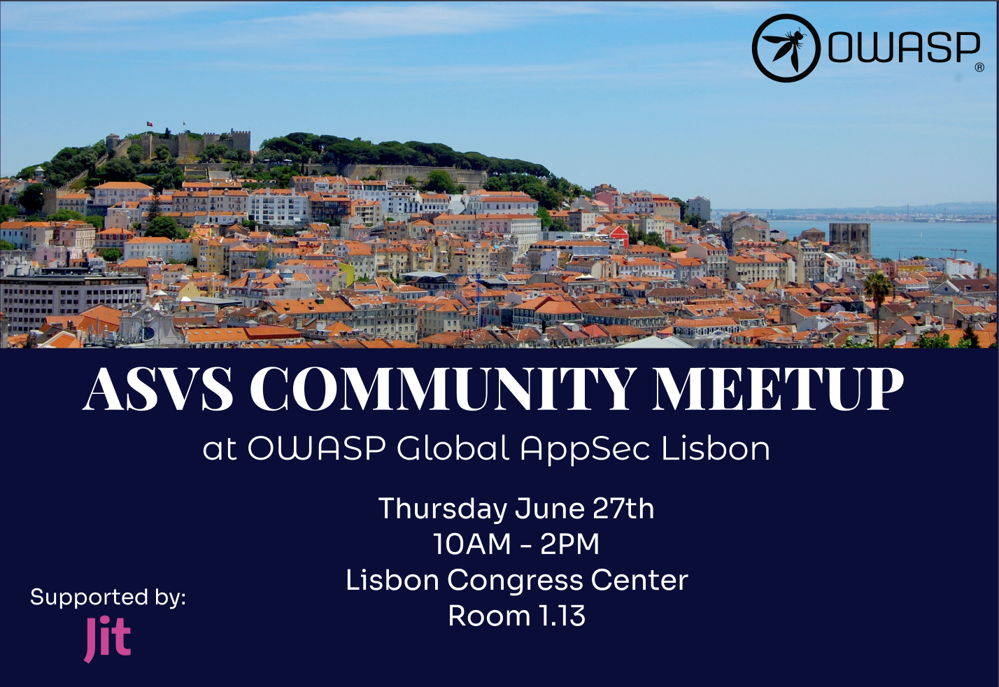

[

# OWASP ASVS Community Meetup 2024

We are excited to announce that we wil be holding a community meetup for the ASVS project as part of Global AppSec Lisbon on 27th June 2024 in room 1.13 of the conference venue!

We are particularly excited that Jim Manico will be giving the opening keynote to reintroduce the ASVS and the background behind the project.

We would love to get more community members involved in the ASVS and other than working on the standard we will also have information about other volunteering opportunities to help develop and promote the project!

We are also planning an update on the current status of the standard and also allocating time to work on the upcoming version 5.0!

We will be releasing more information about the agenda in due course so make sure you follow our social media channels for updates!

